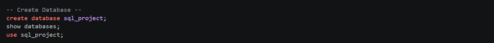
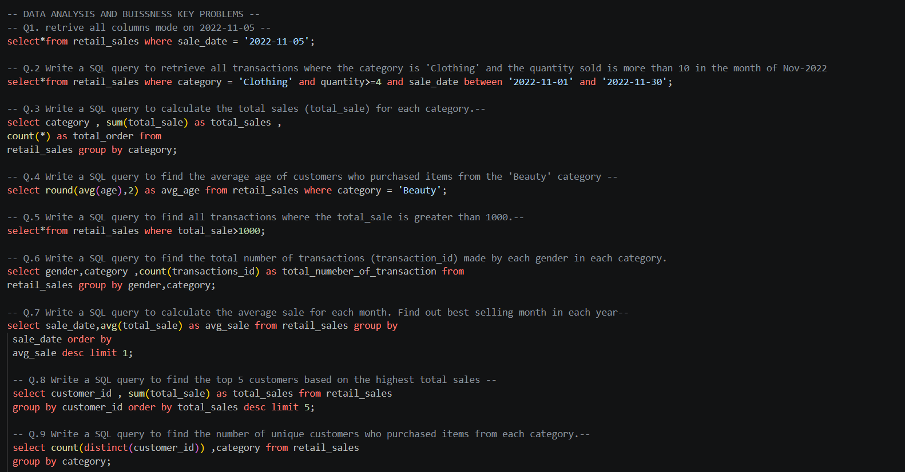
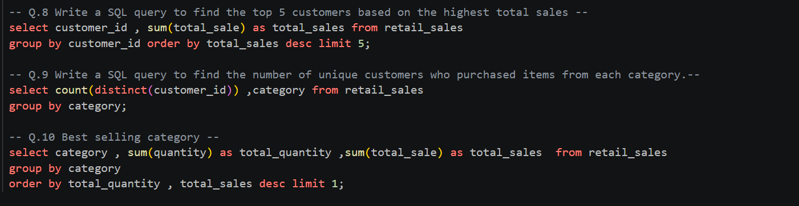
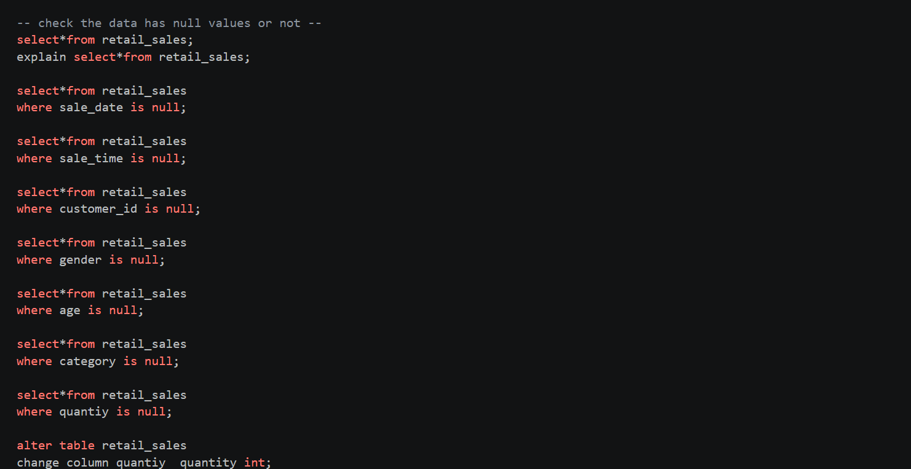

# Retail Sales Analysis Using SQL

## Project Overview

This project focuses on analyzing retail sales data using SQL.  
The goal of this project is to perform data cleaning, exploratory data analysis (EDA), and business analysis using SQL queries to derive meaningful business insights.

This project demonstrates practical SQL skills used by data analysts for solving real-world business problems.

---

# Objectives

- Create and manage a retail sales database
- Perform data cleaning and preprocessing
- Analyze sales trends and customer behavior
- Generate business insights using SQL queries
- Practice SQL concepts such as:
  - GROUP BY
  - ORDER BY
  - Aggregate Functions
  - Window Functions
  - CTEs
  - Filtering and Sorting

---

# Technologies Used

- MySQL
- SQL
- MySQL Workbench

---

# Database Setup

## Create Database

```sql
CREATE DATABASE retail_sales_db;
```

## Create Table

```sql
CREATE TABLE retail_sales (
    transactions_id INT PRIMARY KEY,
    sale_date DATE,
    sale_time TIME,
    customer_id INT,
    gender VARCHAR(15),
    age INT,
    category VARCHAR(50),
    quantity INT,
    price_per_unit FLOAT,
    cogs FLOAT,
    total_sale FLOAT
);
```

---

# Data Cleaning

## Null Value Check

```sql
SELECT *
FROM retail_sales
WHERE sale_date IS NULL
   OR sale_time IS NULL
   OR customer_id IS NULL
   OR gender IS NULL
   OR age IS NULL
   OR category IS NULL
   OR quantity IS NULL
   OR price_per_unit IS NULL
   OR cogs IS NULL;
```

---

# Exploratory Data Analysis

## Total Records

```sql
SELECT COUNT(*) FROM retail_sales;
```

## Unique Customers

```sql
SELECT COUNT(DISTINCT customer_id)
FROM retail_sales;
```

## Product Categories

```sql
SELECT DISTINCT category
FROM retail_sales;
```

---

# Business Analysis Queries

## Sales by Category

```sql
SELECT
    category,
    SUM(total_sale) AS net_sale
FROM retail_sales
GROUP BY category;
```

## Top 5 Customers

```sql
SELECT
    customer_id,
    SUM(total_sale) AS total_sales
FROM retail_sales
GROUP BY customer_id
ORDER BY total_sales DESC
LIMIT 5;
```

## Best Selling Month

```sql
SELECT
    EXTRACT(MONTH FROM sale_date) AS month,
    AVG(total_sale) AS average_sales
FROM retail_sales
GROUP BY month;
```

---

# Key Insights

- Identified top-performing product categories
- Analyzed monthly sales trends
- Identified high-value customers
- Analyzed customer purchase behavior
- Generated sales insights using SQL queries

---

# Screenshots

## Database Creation


---

## Data Analysis & Business Queries


---

## Key Insights Using Queries


---

## Data Preprocessing


---

# SQL Concepts Used

- SELECT Statements
- WHERE Clause
- GROUP BY
- ORDER BY
- Aggregate Functions
- Window Functions
- CTEs
- Data Cleaning
- Exploratory Data Analysis

---

# Project Conclusion

This project helped in understanding how SQL is used for analyzing retail sales data and solving business problems. It strengthened SQL querying, analytical thinking, and data analysis skills.

---

# How to Run the Project

1. Clone the repository
2. Open MySQL Workbench
3. Import the dataset
4. Run SQL queries from `sql_project.sql`
5. Analyze outputs and insights

---

# Author

## Somendra Tailor

If you liked this project, feel free to explore more of my work on GitHub.
